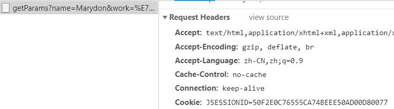
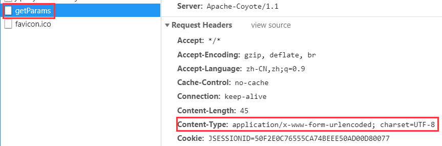

# 关于Http

### 什么是http？**超文本传输协议**，它是一个**应用层**协议。

HTTP（HyperText Transfer Protocol）协议是基于TCP的应用层协议，它不关心数据传输的细节，主要是用来规定客户端和服务端的数据传输格式，最初是用来向客户端传输HTML页面的内容。默认端口是80。

### HTTP简史
#### HTTP 0.9版本  1991年
这个版本就是最初用来向客户端传输HTML页面的，所以只有一个GET命令，然后服务器返回客户端一个HTML页面，不能是其他格式。
利用这个版本完全可以构建一个简单的静态网站了。
#### HTTP 1.0版本  1996年
1.0版本是改变计较大的，尊订了现在HTTP协议的基础，这个版本的协议不仅可以传输HTML的文本页面，还可以传输其他二进制文件，例如：图片、视频。而且还增加了现在常用的POST和HEAD命令。请求消息和响应消息也不是单一的了，规定了一些元数据字段。例如：字符集、编码。状态响应码等。
#### HTTP 1.1版本 1997年
在1.0版本发布之后半年的时间又发布了一个版本，这个版本在1.0版本的基础上更加完善了。这个版本增加了持久连接，就是之前版本的协议一次请求就是一次TCP链接，请求完成后这个链接就关闭掉了。众所周知TCP协议是可靠的，建立连接需要3次握手，断开链接需要4次挥手，并且TCP有流量控制和阻塞控制，有慢开始机制，刚建立链接时传输比较慢，这是比较耗费资源的。一个丰富的页面会有许多图片、表单和超链接。这样的话就会有多次的HTTP请求，所以在这个版本上默认不关闭TCP连接也不声明Connection：keep-alive字段，如果确实要关闭可以指定Connection：close字段。还引入了管道机制，就是说在一个TCP链接里可以同时发送多个HTTP请求，而不必等待上一个请求响应成功再发送。还增加了PUT、PATCH、HEAD、OPTION、DELETE等命令。丰富了客户端和服务端交互动作。还增加了Host字段。
#### HTTP 2.0版本  2015年
这个版本也是随着互联网的发展，有了新的需求定制了新的功能还有对上一个版本的完善。1.1版本有了管道机制，但是在服务端还是要对请求进行排队处理。这个版本可以多工的处理。还有了头信心压缩和服务器的主动推送。

### http特点：
* 无状态的协议，无状态就是客户端的每次请求都没有关系，它们是独立的。
* 只能是客户端发起请求，服务器响应。服务器不能主动向客户端传递消息。
* 底层是基于TCP实现的。

### http报文分为请求报文和响应报文

* 请求报文：它会向Web服务器请求一个动作。
    * 请求报文由请求行（request line）、请求头部（header）、空行和请求数据4个部分组成

    * 请求头

        Accept:

        Accept-Encoding: gzip, deflate, br

        Accept-Language: zh-CN,zh;q=0.9
        
        Cache-Control: max-age=0
        
        Connection: keep-alive 
        
        Host: localhost:8080
        
        Referer: http://localhost:8080/browser/http.html
        
        Sec-Fetch-Dest: document
        
        Sec-Fetch-Mode: navigate
        
        Sec-Fetch-Site: same-origin


* 响应报文：它会将请求的结果返回给客户端。
    * 响应报文由三个部分组成，分别是：状态行、消息报头、响应正文。

    * 响应头

        Accept-Ranges: bytes

        access-control-allow-origin: *

        Content-Length: 287

        Content-Type: text/html; charset=UTF-8

        Date: Thu, 19 Nov 2020 15:57:34 GMT

        ETag: W/"11f-Zn+0AjH/vxli4WLj1EMYz+sNabc"

        Vary: Accept-Encoding

        X-Powered-By: Express

### 前端要重点知道的知识

#### 1. URL（统一资源标识符）

一种特殊类型的URI，包含协议、域名、端口，可能包含虚拟目录、文件名、锚、参数。其中协议，域名，端口一部分不一样，就是跨域。

#### 2. Request Method（请求方式）：

GET，POST，HEAD，PUT，DELETE，CONNECT，OPTIONS，TRACE。常用就是GET,POST，注意它们的区别。

#### 3. 状态码：
* 1xx：指示信息--表示请求已接收，继续处理。
* 2xx：成功--表示请求已被成功接收、理解、接受。
* 3xx：重定向--要完成请求必须进行更进一步的操作。
* 4xx：客户端错误--请求有语法错误或请求无法实现。
* 5xx：服务器端错误--服务器未能实现合法的请求。

**常见状态码**

* 200 OK：客户端请求成功。
* 400 Bad Request：客户端请求有语法错误，不能被服务器所理解。
* 401 Unauthorized：请求未经授权，这个状态代码必须和WWW-Authenticate报头域一起使用。
* 403 Forbidden：服务器收到请求，但是拒绝提供服务。
* 404 Not Found：请求资源不存在，举个例子：输入了错误的URL。
* 500 Internal Server Error：服务器发生不可预期的错误。
* 503 Server Unavailable：服务器当前不能处理客户端的请求，一段时间后可能恢复正常，举个例子：HTTP/1.1 200 OK（CRLF）。

#### 4. cookie与session区别：

* cookie将状态保存在客户端，session将状态保存在服务端。

* session相对于cookie要安全，但cookie不需要占用服务器的资源。

* 单个cookie保存的数据不能超过4K，很多浏览器都限制一个站点最多保存20个cookie。

### HTTPS
HTTPS是http协议的**安全版本**，http协议的数据传输是**明文**的，是不安全的，HTTPS使用了**SSL/TLS**协议进行了**加密处理**。

**http与https的区别**

* HTTP 无法加密，而HTTPS 对传输的数据进行加密，更加安全。

* HTTP 无需证书，而HTTPS 需要CA机构wosign的颁发的SSL证书。

* HTTP 标准端口是80 ，而 HTTPS 的标准端口是443。

* 在OSI 网络模型中，HTTP工作于应用层，而HTTPS 的安全传输机制工作在传输层。


[TCP三次握手及四次挥手](https://www.jianshu.com/p/a1ebc61ce141)

[https工作原理](https://blog.csdn.net/sean_cd/article/details/6966130)

### Content-Type

前端数据传递至后台时，需要对其进行编码，其中，编码格式可分为四种：
1. application/x-www-form-urlencoded，
2. multipart/form-data，
3. application/json，
4. text/plain。

前后台完成数据交互的方式只有两种:
1. form表单提交,
    - form表单通过enctype属性设置编码类型,默认值是: application/x-www-form-urlencoded;
2. ajax提交。
    - ajax可通过contentType属性设置编码类型,默认值也是: application/x-www-form-urlencoded;

#### application/x-www-form-urlencoded
> 后台如何接收?使用request.getParameter('work');来获取参数名和参数值。

　　这种编码格式，是我们最常见的一种方式，将数据封装成一个字符串，参数名和参数值使用"＝"拼接，参数之间使用"&"拼接，最终传递
到后台的数据格式如: key1=value1&key2=value2&...;

　　另外，key和value都会分别使用encodeURI()对其进行编码，也就是你所要传递的数据，实际上已经进行了一次编码，形如：name=Marydon&work=%E7%A8%8B%E5%BA%8F%E5%91%98，服务器接收到后干的第一件事就是使用URLDdecoder.decode()对name和value进行一次解码。不管是form表单请求还是ajax请求，都是这样进行数据组装的。

#### get请求和post请求的区别
- get请求：没有请求体；会直接将form数据拼接到url中，用？隔开，数据对外可见；
- post请求：将数据放到请求体中；无法直观看到要传输的数据，安全性相对高一点。

这是为我们大众所熟知的两个区别，那么问题来了，为何get请求提交的数据携带中文时，后台接收到的中文数据会乱码，而post请求就不会乱码呢？

在来看一下这两请求

**get请求**



**get请求**



后台将请求字符集打印出来
``` java
// 该请求的字符集是
System.out.println(request.getCharacterEncoding());　　
```

通过前后端测试，这次我们可以看出来get请求与post请求的另一个区别：
- 当form表单数据编码类型设置为application/x-www-form-urlencoded时（也就是默认值），浏览器向后台发送请求时，分为两种情况：
- 当请求方式为get时，请求头部信息没有Content-Type属性，也没有指定数据的字符集；
- 当请求方式为post时，请求头部信息有Content-Type属性，并指定数据的字符集，即：application/x-www-form-urlencoded; charset=UTF-8；

那么get请求时，所采用的字符集到底是什么？通过后台测试得出结果：ISO-8859-1
``` java
// get请求默认字符集
contentType : 'application/x-www-form-urlencoded; charset=UTF-8'// 显式声明
```
那么既然如此，在ajax请求中，我们是不是可以显式声明contentType属性，解决get请求乱码问题呢？

``` java
type : 'get',// 请求方式
contentType : 'application/x-www-form-urlencoded; charset=UTF-8',// 显式声明
```
　　网页已经生效,　　结果却令人失望：　　还是乱码，还得重新编码。 
　　Content-Type属性，告诉服务器提交的数据的字符集是utf-8，并让服务器以utf-8格式解析数据，由此可见：
　　问题不在于服务器，而在于浏览器：当浏览器检测到编码格式为application/x-www-form-urlencoded并且为get请求时，浏览器会先用ISO-8859-1对form数据进行编码，然后再用encodeURI()对其进行编码。
　　所以，get请求导致后台接收到的中文出现乱码的根本原因是：页面字符集是utf-8，浏览器却按iso-8859-1进行重新编码，后台接收后以utf-8进行解码当然会出现乱码。

**小结**
- 　　当表单数据的编码格式为：application/x-www-form-urlencoded时：
- 　　get请求，浏览器会将数据按照iso-8859-1进行重新编码，导致后台接收到中文时必然乱码；
- 　　post请求，浏览器会按照utf-8对要提交的数据进行编码，由于后台本身就是使用utf-8对其进行解析，所以才不会出现乱码的情况。
- 　　至于get请求解决乱码问题主要有两种方式，具体见另一篇文章。

#### multipart/form-data
主要用于传输文件，将文件转换成二进制数据进行传输，不涉及转码问题。
> 后台如何接收?使用request.getInputStream();取值。

　　IE浏览器和chrome浏览器下，传输的form数据是不一样的；

　　共同点是：Content-Type的值为multipart/form-data; boundary=--...，貌似没有其它的固定格式，不再考虑，后台只要能接收到就行。

　　结合代码进行实现： 

``` html
<input type="file" id="file" onchange="upload('getParams')" style="display: none;">
<input type="button" value="上传" onclick='javascript:$("#file").click()'>　　
```

``` js
function upload(url) {
    // js 获取文件对象
    var fileObj = document.getElementById("file").files[0];
    if (null === fileObj) {
        alert('图片上传失败，请重试~')
        return;
    }
    // 创建form表单
    var formFile = new FormData();
    // 加入文件对象
    formFile.append('file', fileObj);
    // 创建XMLHttpRequest对象
    var xhr = new XMLHttpRequest();
    // post方式，url为服务器请求地址，true 该参数规定请求是否异步处理。
    xhr.open('post', url, true);
    // 请求完成
    xhr.onload = function () {
        // 将返回数据转换成JSON对象
        var resData = JSON.parse(this.responseText);
        document.getElementById('file').value = "";
    };
    // 请求失败
    xhr.onerror = null;
    // 上传进度调用方法（可实现上传进度条）
    xhr.upload.onprogress = null;
    // 开始上传,发送form数据(以二进制数据传递给后台)
    xhr.send(formFile);
}
```
后台接收
``` java
protected voiddoGet(HttpServletRequest request, HttpServletResponse response) throws ServletException, IOException {
    InputStream is = request.getInputStream();
    int i = 0;
    while ((i = is.read()) != -1) {
        System.out.print((char) i);
    }
}
```

#### application/json

后台如何接收?使用request.getReader()取值，也可以使用request.getInputStream()获取。
