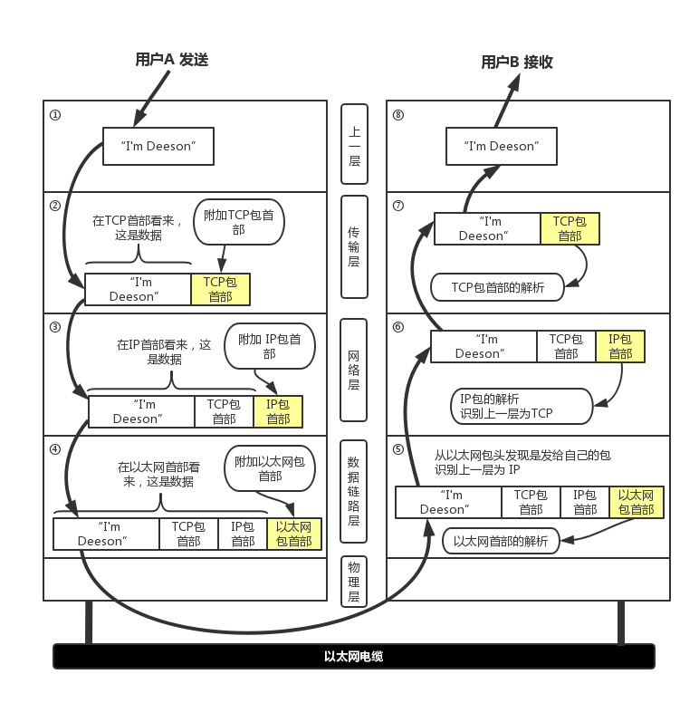

# 页面加载过程

> 抛开了对页面的具体分析，任何的性能优化都是站不住脚的，盲目的使用一些优化措施，结果可能会适得其反。因此切实的去分析页面的实际性能表现，不断的改进测试，才是正确的优化途径。

### 从输入url到页面展示的大致流程
1. 浏览器主进程会校验`url`
    1. 输入内容是url：则转换成完整的url
    2. 如果非url则使用默认的搜索引擎进行搜索
2. 当按下回车键后，在当前页面会尝试调用`beforeunload`
    1. 如果有 addEventListener + beforeunload 并且有设置 preventDefault 那么会弹窗提示
    2. 若用户确认则启动新页面导航
3. 浏览器进入loading状态，主进程构建请求行信息，通过IPC将url发送给`网络进程`
4. 网络进程首先会去查找本地缓存（也就是强缓存）
    1. 有缓存：拦截请求，返回200
5. 若无缓存则开始DNS域名解析，拿到ip
    1. 有DNS缓存：取缓存
6. 尝试建立`TCP`连接
    1. 浏览器有tcp最大并发限制（大部分是6个），如果当前tcp队列超过最大限制则请求会排队等待
    2. ps：TCP 包头很复杂，但是主要关注五个问题，顺序问题，丢包问题，连接维护，流量控制，拥塞控制
7. tcp`三次握手`，然后tcp包装数据（添加tcp头），将数据发送至传输层
8. 若是`https`则需要发起`SSL/TLS`握手
    1. `SSL/TLS`采用对称加密和非对称加密
9. 传输层将数据发送给目标服务器，目标服务器解析
10. 目标服务器检查是否需要重定向
    1. 若需要：返回301或302
11. 目标服务器尝试读取`协商缓存`
12. 服务器发送数据
13. tcp`四次挥手`（关闭连接）
    1. 如果是keep-alive什么的就不需要挥手了
14. 网络进程拿到数据包进行解析，根据响应头做对应处理，遇到`text/html`就通知浏览器进程准备渲染
15. 浏览器进程判断url是否同一站点
    1. 同一站点：复用渲染进程
    2. 否则：创建新渲染进程
16. 浏览器进程通知渲染进程`接收网络进程数据`
17. 渲染进程接收完数据后通知浏览器主进程`更新页面状态`
18. 渲染进程对页面进行`加载、解析`
    1. 构建DOM树和styleSheet（CSSOM）
    2. 合并DOM和CSSOM，生成 `computedStyle` 得到 layout tree
19. 画布绘制
    1. 绘制会有分层、分块、合成
    2. 如果需要3d渲染，会通知主进程调用 GPU进程
    3. JS资源要等脚本下载完成并执行后才会继续解析HTML（此时可以使用defer和async）
        * defer是延迟执行。类似放在body后面
        * async是异步执行。下载完毕执行

其实最根本的原理是：代码经过ast语法解析生成字节码，最后编译成二进制码（机器码）然后存入内存，系统将第一条内存指令存入cpu的寄存器中，cpu进行读取、分析、执行指令。

### 网络传输过程

