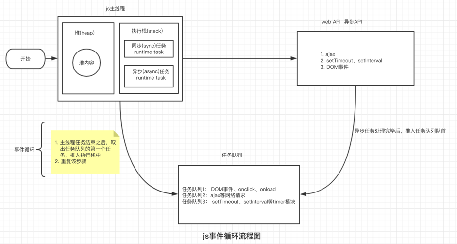
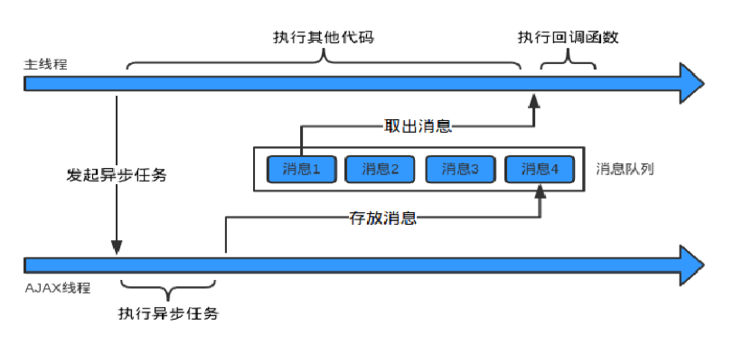

# JS运行机制

>Javascript是一种单线程开发语言。理解Javascript的运行机制是日常编码必须要掌握的技能。

会讲述以下内容

1. JS单进程的优缺点
2. Event Loop
3. 宏任务和微任务
4. 实例讲解

### 为什么是单线程？

JavaScript的主要用途是与用户交互，以及操作DOM。这决定了它只能是单线程，否则会带来很复杂的同步问题。

* 假设：如果JavaScript支持多线程，一个线程在某个DOM节点上添加内容，另外一个线程删除了这个节点，那么浏览器该以哪个线程为准呢？

单线程也避免了多线程的线程创建、线程上下文切换的开销。（Nginx 也是单线程的）

### 单线程的缺点

单线程就意味着容易发生线程等待资源，cpu空闲，而其他任务一直等待的问题。

### 什么是Event Loop（事件循环）

为了协调事件、用户交互、脚本、UI 渲染和网络处理等行为，防止主线程阻塞。于是Javascript设计者将所有任务分为两种，一种是同步任务，一种是异步任务

* 同步任务指的是，在`主线程`上排队执行的任务
    * 同步任务只有前一个任务执行完毕，才能执行下一个任务。
    * 同步任务都在主线程上执行，形成一个`执行栈`
      * 每次执行栈执行的代码就是一个宏任务

* 异步任务指的是，不进入主线程，而进入任务队列的任务。
  * 只要指定过回调函数，这些事件发生时就会进入"任务队列"（比如鼠标点击...等）
  * 一旦`执行栈中的所有同步任务执行完毕`，系统就会读取“任务队列”。
  * 任务队列是一个先进先出的数据结构，排在前面的事件，优先被主线程读取。

"主线程"从"任务队列"中读取事件，这个过程是循环不断的，所以整个的这种运行机制又称为Event Loop（事件循环）。

### 宏任务和微任务

根据规范：每个任务都有一个任务源(task source)，源自同一个任务源的 task 必须放到同一个任务队列，从不同源来的则被添加到不同队列，所以有了宏任务(macro)task和微任务(micro)task。

浏览器为了能够使得JS内部(macro)task与DOM任务能够有序的执行，会在**一个task执行结束后，在下一个(macro)task 执行开始前，对页面进行重新渲染，**

**每次执行完一个宏任务之后，会去检查是否存在微任务；**如果有，则执行微任务直至**清空微任务队列**（如果在微任务执行期间微任务队列加入了新的微任务，会将新的微任务加入队列尾部，之后也会被执行）。

根据上述总结流程为：


附（宏/微任务清单）：

* 宏任务(macro)task主要有：
script(整体代码)、setTimeout、setInterval、I/O、UI交互事件、postMessage、MessageChannel、setImmediate(Node.js 环境)
* 微任务(micro)task主要有： Promise.then、MutaionObserver、process.nextTick(Node.js 环境)
  
### 实例分析
``` js
console.log(1)

Promise.resolve(2).then(console.log)

requestIdleCallback(() => {
    console.log(3);
    Promise.resolve(4).then(console.log)
})

setTimeout(() => {
    console.log(6)
    Promise.resolve(7).then(console.log)
}, 0)

requestAnimationFrame(() => {
    console.log(8)
    Promise.resolve(9).then(console.log)
})

var intersectionObserver = new IntersectionObserver(function(entries) {
    if (entries[0].intersectionRatio <= 0) return;
    console.log('LoadedNewItems');
    Promise.resolve('doSomething').then(console.log)
});
// 开始监听
intersectionObserver.observe(document.querySelector('div'));

new Promise(reslove => reslove(5)).then(console.log)

console.log(10)
```

以上案例会打印 1 10 2 5 -> undefined -> 8 9 LoadedNewItems doSomething 6 7 3 4 如果没有 intersectionObserver 会打印 1 10 2 5 -> undefined -> 8 9 3 4 6 7

结果解析：
1. JavaScript执行主线程任务：`打印 1 10`
   * 附：Promise构造器内部是同步任务
2. 执行微任务队列：`打印 2 5`
3. 宏任务和微任务都执行完成：`打印 undefined` 
4. 执行`requestAnimationFrame` ，打印`8`
5. 执行`requestAnimationFrame`的微任务，打印`9`
6. 执行`IntersectionObserver`，打印 `LoadedNewItems`
7. 执行`IntersectionObserver`的微任务，打印 `doSomething`
8. 更新界面
9. 如果浏览器空闲，调用`requestIdleCallback`，打印 `3`
    * 如果r`equestIdleCallback`被调用，那么会继续执行微任务，打印 `4`
10. 一帧结束：
11. 下一帧开始：执行`settimeout`，打印 `6`
12. 执行`settimeout`的微任务，打印 `7`
    
### 结论
1. 宏任务
2. 微任务
3. requestAnimationFrame
4. IntersectionObserver
5. 更新界面
6. requestIdleCallback
7. 下一帧


JavaScript引擎是单线程运行的，浏览器无论在什么时候都只且只有一个线程在运行JavaScript程序。

浏览器的内核是多线程的，它们在内核制控下相互配合以保持同步，一个浏览器至少实现三个常驻线程：javascript引擎线程，GUI渲染线程，浏览器事件触发线程。这些异步线程都会产生不同的异步的事件。


1. javascript引擎是基于事件驱动单线程执行的，JS引擎一直等待着任务队列中任务的到来，然后加以处理，浏览器无论什么时候都只有一个JS线程在运行JS程序。
2. GUI渲染线程负责渲染浏览器界面，当界面需要重绘（Repaint）或由于某种操作引发回流(reflow)时,该线程就会执行。但需要注意 GUI渲染线程与JS引擎是互斥的，当JS引擎执行时GUI线程会被挂起，GUI更新会被保存在一个队列中等到JS引擎空闲时立即被执行。
3. 事件触发线程，当一个事件被触发时该线程会把事件添加到待处理队列的队尾，等待JS引擎的处理。这些事件可来自JavaScript引擎当前执行的代码块如setTimeOut、也可来自浏览器内核的其他线程如鼠标点击、AJAX异步请求等，但由于JS的单线程关系所有这些事件都得排队等待JS引擎处理。（当线程中没有执行任何同步代码的前提下才会执行异步代码）。

当程序启动时, 一个进程被创建，同时也运行一个线程, 即为主线程，js的运行机制为单线程


程序中跑两个线程，一个负责程序本身的运行，作为主线程； 另一个负责主线程与其他线程的的通信，被称为“Event Loop 线程" 。每当遇到异步任务，交给 EventLoop 线程，然后自己往后运行，等到主线程运行完后，再去 EventLoop 线程拿结果。

1. 所有任务都在主线程上执行，形成一个执行栈（execution context stack）。
2. 主线程之外，还存在一个"任务队列"（task queue）。系统把异步任务放到"任务队列"之中，然后继续执行后续的任务。
3. 一旦"执行栈"中的所有任务执行完毕，系统就会读取"任务队列"。如果这个时候，异步任务已经结束了等待状态，就会从"任务队列"进入执行栈，恢复执行。
4. 主线程不断重复上面的第三步。

"回调函数"（callback），就是那些会被主线程挂起来的代码。异步任务必须指定回调函数，当异步任务从"任务队列"回到执行栈，回调函数就会执行。"任务队列"是一个先进先出的数据结构，排在前面的事件，优先返回主线程。主线程的读取过程基本上是自动的，只要执行栈一清空，"任务队列"上第一位的事件就自动返回主线程。 

主线程从"任务队列"中读取事件，这个过程是循环不断的，所以整个的这种运行机制又称为Event Loop。

### 从主线程的角度看，一个异步过程包括下面两个要素：

发起函数(或叫注册函数)A
回调函数callbackFn
它们都是在主线程上调用的，其中注册函数用来发起异步过程，回调函数用来处理结果。

### 异步进程有:
类似onclick等，由浏览器内核的DOM binding模块处理，事件触发时，回调函数添加到任务队列中；
setTimeout等，由浏览器内核的Timer模块处理，时间到达时，回调函数添加到任务队列中；
Ajax，由浏览器内核的Network模块处理，网络请求返回后，添加到任务队列中。

例如setTimeout(fn, 1000)，其中的setTimeout就是异步过程的发起函数，fn是回调函数。用一句话概括：工作线程将消息放到消息队列，主线程通过事件循环过程去取消息。

消息队列：消息队列是一个先进先出的队列，它里面存放着各种消息。
事件循环：事件循环是指主线程重复从消息队列中取消息、执行的过程。



流程如下:

1. 主线程读取js代码, 形成相应的堆和执行栈, 执行同步任务
2. 当主线程遇到异步任务,，指定给异步进程处理, 同时继续执行同步任务
3. 当异步进程处理完毕后， 将相应的异步任务推入到任务队列首部
4. 主线程任务处理完毕后,，查询任务队列，则取出一个任务队列推入到主线程的执行栈
5. 重复执行第2、3、4步，这就称为事件循环
