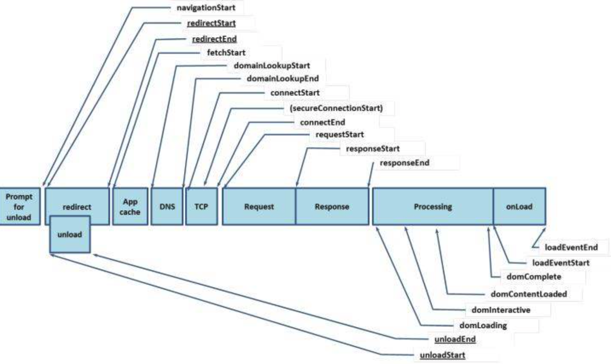
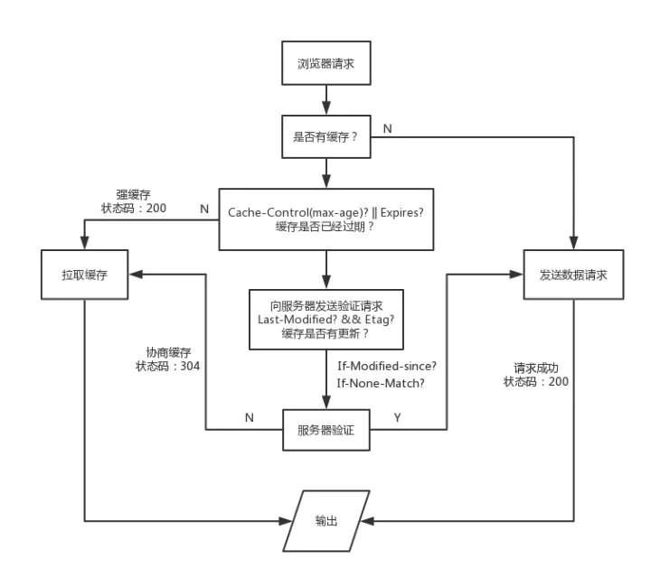
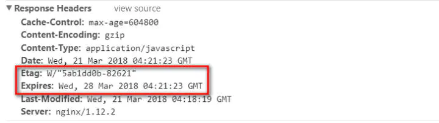

# 性能优化

### 网络传输性能优化
在开始介绍网络传输性能优化这项工作之前，我们需要了解浏览器处理用户请求的过程，那么就必须奉上这幅神图了：

这是navigation timing监测指标图，从图中我们可以看出，浏览器在得到用户请求之后，经历了下面这些阶段：重定向→拉取缓存→DNS查询→建立TCP链接→发起请求→接收响应→处理HTML元素→元素加载完成。不着急，我们将对其中的细节一步步展开讨论：

### 1.1.浏览器缓存

我们都知道，浏览器在向服务器发起请求前，会先查询本地是否有相同的文件，如果有，就会直接拉取本地缓存，这和我们在后台部属的Redis、Memcache类似，都是起到了中间缓冲的作用，我们先看看浏览器处理缓存的策略：



这里我们可以使用chrome devtools里的network面板查看网络传输的相关信息：

（这里需要特别注意，在我们进行缓存调试时，需要去除network面板顶部的`Disable cache` 勾选项，否则浏览器将始终不会从缓存中拉取数据）

浏览器默认的缓存是放在内存内的，但我们知道，内存里的缓存会因为进程的结束或者说浏览器的关闭而被清除，而存在硬盘里的缓存才能够被长期保留下去。很多时候，我们在network面板中各请求的size项里，会看到两种不同的状态：`from memory cache` 和 `from disk cache`，前者指缓存来自内存，后者指缓存来自硬盘。而控制缓存存放位置的，不是别人，就是我们在服务器上设置的Etag字段。在浏览器接收到服务器响应后，会检测响应头部（Header），如果有Etag字段，那么浏览器就会将本次缓存写入硬盘中。

之所以拉取缓存会出现200、304两种不同的状态码，取决于浏览器是否有向服务器发起验证请求。 只有向服务器发起验证请求并确认缓存未被更新，才会返回304状态码。

这里我以nginx为例，谈谈如何配置缓存:首先，我们先进入nginx的配置文档

`$ vim nginxPath/conf/nginx.conf`

在配置文档内插入如下两项：

```
 etag on;   //开启etag验证
expires 7d;    //设置缓存过期时间为7天
```

打开我们的网站，在chrome devtools的network面板中观察我们的请求资源，如果在响应头部看见Etag和Expires字段，就说明我们的缓存配置成功了。



>特别注意:

>在我们配置缓存时一定要切记，浏览器在处理用户请求时，如果命中强缓存，浏览器会直接拉取本地缓存，不会与服务器发生任何通信，也就是说，如果我们在服务器端更新了文件，并不会被浏览器得知，就无法替换失效的缓存。所以我们在构建阶段，需要为我们的静态资源添加md5 hash后缀，避免资源更新而引起的前后端文件无法同步的问题。

### 1.2.资源打包压缩
我们之前所作的浏览器缓存工作，只有在用户第二次访问我们的页面才能起到效果，如果要在用户首次打开页面就实现优良的性能，必须对资源进行优化。我们常将网络性能优化措施归结为三大方面：减少请求数、减小请求资源体积、提升网络传输速率。现在，让我们逐个击破：

结合前端工程化思想，我们在对上线文件进行自动化打包编译时，通常都需要打包工具的协助，这里我推荐webpack，我通常都使用Gulp和Grunt来编译node，Parcel太新，而且webpack也一直在自身的特性上向Parcel靠拢。

在对webpack进行上线配置时，我们要特别注意以下几点：

①JS压缩：（这点应该算是耳熟能详了，就不多介绍了）
``` js
new webpack.optimize.UglifyJsPlugin()
```

②HTML压缩：
``` js
new HtmlWebpackPlugin({
            template: __dirname + '/views/index.html', // new 一个这个插件的实例，并传入相关的参数
            filename: '../index.html',
            minify: {
                removeComments: true,
                collapseWhitespace: true,
                removeRedundantAttributes: true,
                useShortDoctype: true,
                removeEmptyAttributes: true,
                removeStyleLinkTypeAttributes: true,
                keepClosingSlash: true,
                minifyJS: true,
                minifyCSS: true,
                minifyURLs: true,
            },
            chunksSortMode: 'dependency'
        })
```

我们在使用html-webpack-plugin 自动化注入JS、CSS打包HTML文件时，很少会为其添加配置项，这里我给出样例，大家直接复制就行。

PS：这里有一个技巧，在我们书写HTML元素的src 或 href 属性时，可以省略协议部分，这样也能简单起到节省资源的目的。

③提取公共资源：
``` js 
new webpack.optimize.CommonsChunkPlugin({
            name: 'vendor',
            filename: 'scripts/common/vendor-[hash:5].js'
        })
```

PS:这里是webpack3的语法，在webpack4中已作更改，希望大家注意

④提取css并压缩：

⑤使用webpack3的新特性：ModuleConcatenationPlugin


### 1.3.图片资源优化
刚刚我们介绍了资源打包压缩，只是停留在了代码层面，而在我们实际开发中，真正占用了大量网络传输资源的，并不是这些文件，而是图片，如果你对图片进行了优化工作，你能立刻看见明显的效果。

#### 1.3.1.不要在HTML里缩放图像

#### 1.3.2.使用雪碧图（CSS Sprite）

#### 1.3.3.使用字体图标（iconfont）

#### 1.3.4.使用WebP

### 1.4.网络传输性能检测工具——Page Speed

### 1.5.使用CDN

